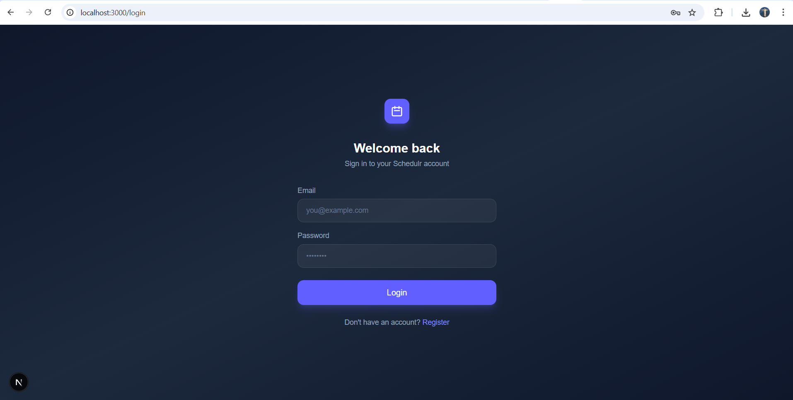
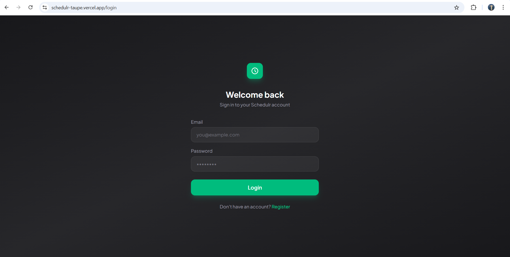
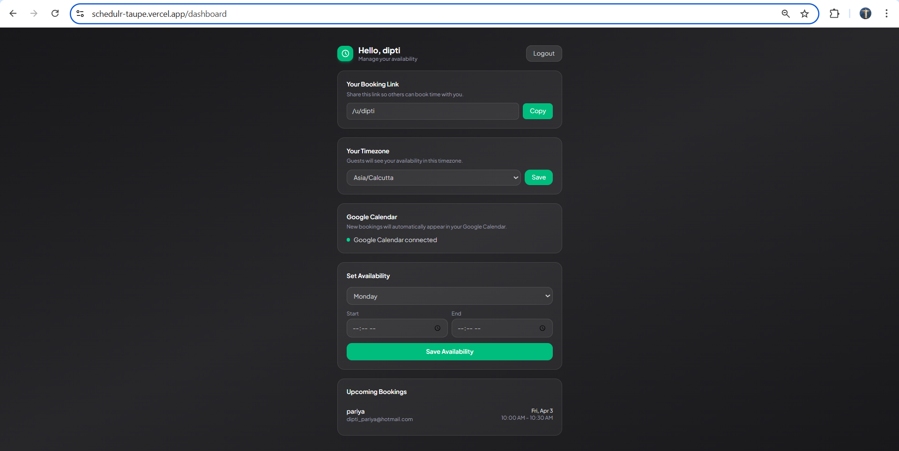
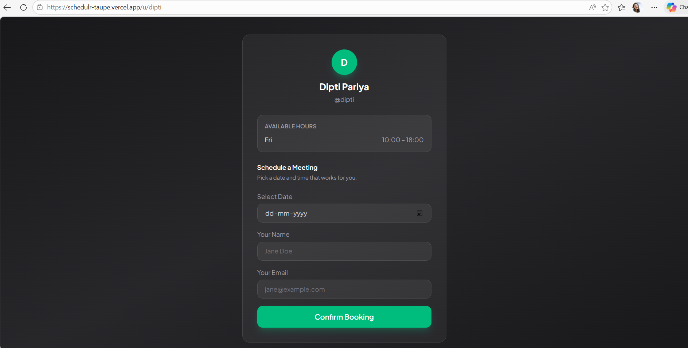

# Schedulr

A Calendly-style scheduling app built with Next.js. Users set their availability, share a booking link, and meetings are automatically synced to Google Calendar — with email notifications sent to the host.

---

## Screenshots

### Login & Dashboard





### Booking Form



---

## Features

- **Authentication** — Secure login with NextAuth
- **Availability Management** — Set your weekly available time slots
- **Public Booking Page** — Share your link; guests pick a slot and book
- **Google Calendar Sync** — Meetings are automatically added to your calendar and the guest receives an invite
- **Email Notifications** — Host gets an email when a new booking is made

---

## Tech Stack

- [Next.js](https://nextjs.org/) — App Router
- [Supabase](https://supabase.com/) — Hosted PostgreSQL database
- [Prisma](https://www.prisma.io/) — Database ORM (PostgreSQL)
- [NextAuth.js](https://next-auth.js.org/) — Authentication
- [Google Calendar API](https://developers.google.com/calendar) — Calendar sync
- [Nodemailer](https://nodemailer.com/) — Email notifications

---

## Getting Started

### 1. Clone the repo

```bash
git clone https://github.com/your-username/schedulr.git
cd schedulr
```

### 2. Install dependencies

```bash
npm install
```

### 3. Set up environment variables

Copy `.env-example` to `.env` and fill in the values:

```bash
cp .env-example .env
```

| Variable               | Description                                            |
| ---------------------- | ------------------------------------------------------ |
| `DATABASE_URL`         | Supabase PostgreSQL connection string                  |
| `DIRECT_URL`           | Supabase direct connection URL (for Prisma migrations) |
| `NEXTAUTH_SECRET`      | Random secret for NextAuth                             |
| `NEXTAUTH_URL`         | Base URL (e.g. `http://localhost:3000`)                |
| `NEXT_PUBLIC_BASE_URL` | Same as above, exposed to the client                   |
| `GOOGLE_CLIENT_ID`     | Google OAuth client ID                                 |
| `GOOGLE_CLIENT_SECRET` | Google OAuth client secret                             |
| `SMTP_HOST`            | SMTP host (e.g. `smtp.gmail.com`)                      |
| `SMTP_PORT`            | SMTP port (e.g. `587`)                                 |
| `SMTP_USER`            | Your email address                                     |
| `SMTP_PASS`            | Gmail App Password (16 characters, no spaces)          |

### 4. Run database migrations

```bash
npx prisma migrate dev
```

### 5. Start the dev server

```bash
npm run dev
```

Open [http://localhost:3000](http://localhost:3000).

---

## Google OAuth Setup

1. Go to [Google Cloud Console](https://console.cloud.google.com/)
2. Create a project and enable the **Google Calendar API**
3. Create OAuth 2.0 credentials
4. Add `http://localhost:3000/api/auth/callback/google` as an authorized redirect URI
5. Copy the client ID and secret into your `.env`

## Supabase Setup

1. Go to [supabase.com](https://supabase.com/) and create a new project
2. Once the project is ready, go to **Settings → Database**
3. Copy the **Connection string** (URI) — use the **Session mode** URL (port `5432`) as `DATABASE_URL`
4. Copy the **Direct connection** URL as `DIRECT_URL` (required for Prisma migrations)
5. Paste both into your `.env`

> Supabase is used as the hosted PostgreSQL database. Prisma connects to it via the connection string.

---

## Gmail SMTP Setup

1. Enable 2-Step Verification on your Google account
2. Go to **Security → App passwords** and generate one for "Mail"
3. Use the 16-character password (without spaces) as `SMTP_PASS`
